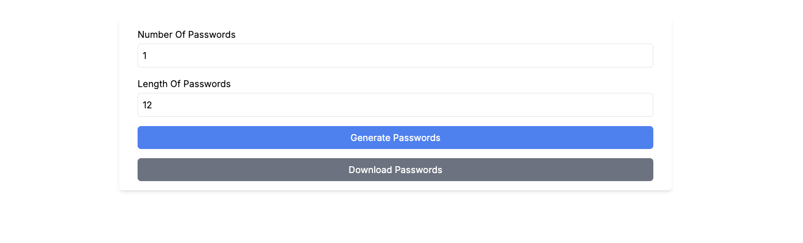

# **Password Generator API**

A secure password generator API built with **Next.js**, **TypeScript**, and **Tailwind CSS**. This application allows users to generate strong, customizable passwords with an intuitive UI for desktop and mobile devices.

## 🚀 **Live Demo**  
Check out the live version of the app hosted on [Vercel](https://password-generator-api-rosy.vercel.app/).

---

## 🛠️ **Features**

- 🔐 **Customizable Passwords**: Generate up to 100,000 passwords with lengths from 12 to 50 characters.  
- ⚡ **Secure Generation**: Uses Node.js \`crypto.randomBytes\` to ensure randomness and security.    
- 📥 **Download Passwords**: Download generated passwords as a text file.   

---

## 🖼️ **Screenshots**



---

## 🔧 **Technologies Used**

- **Next.js**: Server-side rendering and API routes.  
- **TypeScript**: Static typing for robust and maintainable code.  
- **Tailwind CSS**: Utility-first CSS for a modern, responsive design.  
- **Node.js Crypto**: Secure password generation using Node.js \`crypto\`.  

---

## 🚀 **Getting Started**

### **Installation**
1. **Clone the repository**:  
   ```bash
   git clone https://github.com/your-username/password-generator-api.git
   cd password-generator-api
   ```
2. **Install dependencies**:  
   ```bash
   npm install
   # or
   yarn install
   ```
3. **Run the development server**:  
   ```bash
   npm run dev
   # or
   yarn dev
   ```
4. **Access the app** at [http://localhost:3000](http://localhost:3000).

### **Production Build**
To create a production build:  
```bash
npm run build
npm run start
```

---

## 📋 **How It Works**

1. **Access the main page**.  
2. **Set your preferences**: Number of passwords (1 to 100,000) and password length (12 to 50 characters).  
3. **Generate passwords**: Click "Generate Passwords" to receive a secure list of passwords.  
4. **Download passwords**: Download the passwords as a text file for offline use.  

---

## 📈 **Performance & Security**

- **Efficient Generation**: Uses \`crypto.randomBytes\` for secure, random password generation.  
- **Server-Side Validation**: All query parameters are validated to prevent abuse.  
- **Input Limits**: Number of passwords capped at 100,000, with password length constrained to 12-50 characters.

---

## 📚 **Learn More**
- [Next.js Documentation](https://nextjs.org/docs)  
- [TypeScript Documentation](https://www.typescriptlang.org/docs/)  
- [Tailwind CSS Documentation](https://tailwindcss.com/docs)  

---

## 🧑‍💻 **Author**

Developed by [Nikola](https://github.com/ndim99).  


